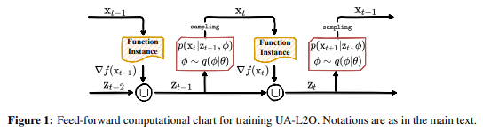

# Bayesian Modeling and Uncertainty Quantification for Learning to Optimize: What, Why, and How

TensorFlow implementation for [Bayesian Modeling and Uncertainty Quantification for Learning to Optimize: What, Why, and How]()

Yuning You, Yue Cao, Tianlong Chen, Yongduo Sui, Ting Chen, Zhangyang Wang, Yang Shen

In ICLR 2022.

## Overview

In this repository, we perform Bayesian modeling in learning to optimize techniques, to address the practical need of accessment and quantification of optimization uncertainty.
Experiments are conducted on optimizations in test functions, privacy attacks and protein docking.




## Environments
Create conda environment via:
```
conda env create -f environment.yml
cd sonnet_modified_files
```
and then copy files: ```basic.py```, ```gated_rnn.py``` into the conda environment directory as:
```
cp gate_rnn.py $CONDAENV_PATH/envs/tf_gpu_1.14/lib/python3.7/site-packages/sonnet/python/modules/
cp basic.py $CONDAENV_PATH/envs/tf_gpu_1.14/lib/python3.7/site-packages/sonnet/python/modules/
```

## Training & Evaluation
```
mkdir ./weights; mkdir ./logs; cd src
```
Stage 1 training:
```
python train_dm_rs_cl.py --problem $problem_name --stage 1 --save_path ../weights/${problem_name}_stage1.ckpt
```

Stage 2 Bayesian training:
```
python train_dm_rs_cl.py --problem $problem_name --stage 2 --restore_path ../weights/${problem_name}_stage1.ckpt --save_path ../weights/${problem_name}_stage2.ckpt --lambda1 0.1
```

Evaluation:
```
python evaluate.py --problem $problem_name --path ../weights/${problem_name}_stage2.ckpt --output ../logs/${problem_name}.log --mode test
```
where
* ```$problem_name``` = rastrigin06, rastrigin12, rastrigin18, rastrigin24, rastrigin30 means train on test function rastrigin on dim=6, 12, 18, 24, 30, respectively.
* ```$problem_name``` = ackley06, ackley12, ackley18, ackley24, ackley30.
* ```$problem_name``` = griewank06, griewank12, griewank18, griewank24, griewank30.
* ```$problem_name``` = privacy_attack means privacy_attack experiment.
* ```$problem_name``` = protein_dock means protein docking experiment.

and you can select ```$lambda1``` from {10, 1, 0.1, 0.01, 0.001}.


## Citation

If you use this code for you research, please cite our paper.
```
TBD
```


